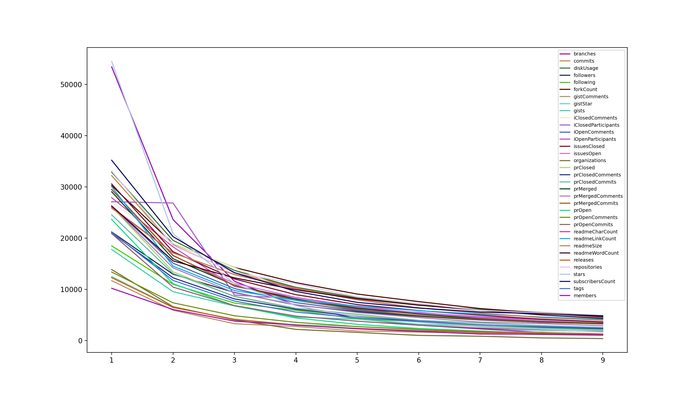
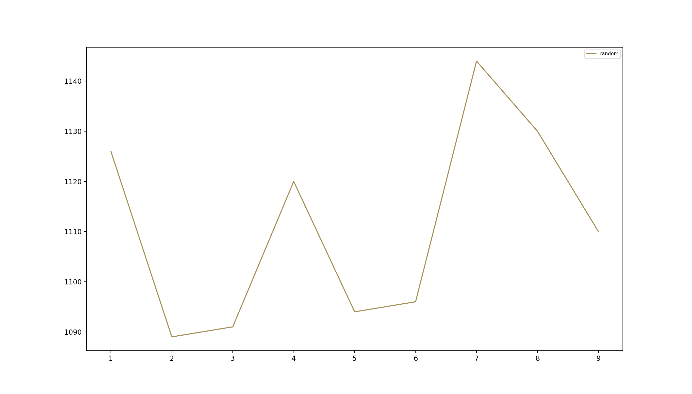

# Benford's law and GitHub

Put (very) simply [Benford's law](https://en.wikipedia.org/wiki/Benford%27s_law) shows that no matter what numerical dataset we take in the real world, if we count the occurrences of the first non zero digit of each number, their distribution will always follow a logarithmic pattern.

Benford's law is used in many areas to verify the authenticity of a dataset. For example the IRS (and other similar institutions around the world) [uses it to check your tax returns](https://www.mentalfloss.com/article/63099/irss-favorite-mathematical-law). It's also been used [to detect election fraud (or behavioral anomalies)](https://www.cambridge.org/core/journals/political-analysis/article/benfords-law-and-the-detection-of-election-fraud/3B1D64E822371C461AF3C61CE91AAF6D) and it's used in forensics [to detect whether an image has been modified](https://www.researchgate.net/publication/242075449_A_generalized_Benford's_law_for_JPEG_coefficients_and_its_applications_in_image_forensics_-_art_no_65051L).

In other words: it's pretty mind blowing. I found out about it while watching the new Netflix original series [Connected](https://www.netflix.com/title/81031737) and I wanted to test it on a couple of datasets myself.

Turns out that the same pattern can be seen with *all* (except `iClosedParticipants`, no idea why or what that is, to be honest) aggregate metrics of all GitHub repositories with at least 100 stars as shown in the screenshot below:

Generating pseudo random numbers clearly breaks the pattern:

Neat!

# How do I use this?

`pip install matplotlib`

`python blow_my_mind.py`

# Credits

Thanks to [Doodies/Github-Stars-Predictor](https://github.com/Doodies/Github-Stars-Predictor/) for the GitHub dataset.